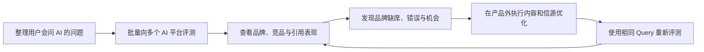
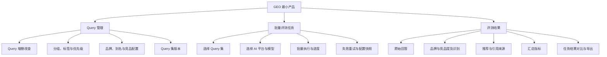

# GEO 产品说明

> 本文基于 `projects/GEO/参考文件/` 中的 GEO 概念、服务商和产品材料整理。  
> 文档目标：说明 GEO 产品是什么、为谁解决什么问题，以及首版产品应该提供哪些能力。

## 一、什么是 GEO

GEO（Generative Engine Optimization，生成式引擎优化）是围绕生成式 AI 回答进行的品牌可见度优化。

当用户向豆包、DeepSeek、Kimi、通义千问、ChatGPT 等 AI 产品询问：

- 有哪些值得选择的品牌？
- 某类产品哪个好？
- A 品牌和 B 品牌有什么区别？
- 某个品牌是否值得信任？

AI 会直接整理信息并给出答案。用户可能只阅读 AI 推荐的少数品牌，不再逐个浏览传统搜索结果。

GEO 关注的核心问题是：

> 在用户向 AI 提问时，品牌有没有被提及、如何被描述、是否被推荐、引用了哪些信息来源？

## 二、GEO 产品是什么

GEO 产品是一套帮助企业持续检测和分析品牌在 AI 回答中表现的工具。

它通过管理一组用户可能提出的问题，批量向不同 AI 平台发起提问，并分析返回结果，帮助企业看清：

- 哪些问题中出现了自己的品牌。
- AI 是否明确推荐了自己的品牌。
- AI 如何描述品牌，以及描述是否准确。
- 哪些竞品更频繁地被提及或推荐。
- AI 回答引用了哪些网站和内容来源。
- 品牌完成内容优化后，AI 回答是否发生变化。

GEO 产品首先解决的是“看不见、说不清、无法验证”的问题，而不是承诺自动让品牌被 AI 推荐。

## 三、解决什么人的什么问题

### 1. 品牌与市场负责人

**当前问题**

- 不知道品牌是否进入了 AI 推荐名单。
- 不知道竞品在 AI 中的表现为什么更好。
- 担心 AI 使用错误、过时或负面的品牌信息。
- 无法判断 GEO 是否值得投入，以及投入后是否有效。

**产品帮助**

- 持续监测品牌在多个 AI 平台的提及和推荐表现。
- 识别品牌缺席、错误描述和竞品领先的问题。
- 用可追溯的评测结果支持投入决策。

### 2. 内容、SEO 与品牌运营人员

**当前问题**

- 不知道用户会向 AI 提出哪些问题。
- 不知道应该优先优化哪些内容。
- 发布内容后，无法判断是否影响了 AI 回答。

**产品帮助**

- 将真实用户问题整理成可管理的 Query 集。
- 从评测结果中发现内容缺口和信源差距。
- 通过重复评测观察优化前后的变化。

### 3. GEO 服务商与营销代理团队

**当前问题**

- 很难向客户证明服务前后的实际变化。
- 多个客户、多个 AI 平台和大量问题难以人工管理。
- 服务效果容易停留在截图和主观判断。

**产品帮助**

- 批量管理客户 Query 和多平台评测任务。
- 使用统一指标和原始回答形成交付报告。
- 将服务效果从一次性展示变成持续监测。

## 四、产品价值在哪里

### 1. 让品牌看见 AI 如何影响用户决策

传统流量工具主要统计搜索排名、点击和访问量，但无法回答 AI 最终向用户推荐了谁。GEO 产品补足了这一观察盲区。

### 2. 将模糊的 GEO 效果变成可测量结果

通过固定 Query 集、评测任务和原始回答，品牌可以持续观察：

- 品牌提及率。
- 品牌推荐率。
- 与竞品的答案份额。
- 品牌自有内容或指定信源的引用率。
- 品牌错误描述数量。

### 3. 帮助用户找到真正值得优化的问题

GEO 产品不是泛泛地建议“多发内容”，而是帮助用户定位：

- 哪些高价值问题中品牌完全缺席。
- 哪些问题中竞品持续领先。
- 哪些回答引用了过时或错误的信息。
- 哪些网站和内容更容易成为 AI 的引用来源。

### 4. 帮助用户验证优化是否有效

用户完成官网更新、内容补充或信源建设后，可以使用相同 Query 和评测配置重新测试，对比优化前后的变化。

产品不能证明单次变化一定由某项优化导致，但可以帮助用户持续积累证据、识别趋势并减少盲目投入。

## 五、GEO 与 SEO 的区别

| 对比维度 | SEO | GEO |
| --- | --- | --- |
| 优化对象 | 搜索引擎结果页 | 生成式 AI 回答 |
| 核心目标 | 提高网页排名和自然流量 | 提高品牌被提及、引用和推荐的机会 |
| 用户行为 | 搜索关键词后点击网页 | 向 AI 提问并直接阅读答案 |
| 核心观察对象 | 关键词排名、曝光、点击、流量 | Query、AI 回答、品牌提及、推荐和引用源 |
| 主要结果 | 用户进入网站 | 品牌进入用户候选名单和决策过程 |
| 效果评估 | 排名与流量相对稳定、容易追踪 | 回答存在随机性，需要重复评测和趋势观察 |

GEO 并不等于 SEO 的替代品。

SEO 帮助内容被搜索引擎发现、收录和建立可信度，这些能力同样可能影响 AI 获取信息。更准确的关系是：

> SEO 解决“能否被找到”，GEO 进一步观察和优化“能否被 AI 选入答案”。

## 六、GEO 产品可以帮助用户做什么

产品帮助用户完成三件核心事情：

### 1. 确定需要监测什么

- 建立和维护 Query。
- 按品牌认知、产品比较、品牌推荐、品牌评价等场景分组。
- 为高价值 Query 设置优先级。

### 2. 稳定地执行 AI 评测

- 选择 Query 集和目标 AI 平台。
- 批量发起评测任务。
- 保存模型、时间、参数和原始回答。
- 查看任务进度并重试失败项。

### 3. 看懂评测结果

- 判断品牌是否被提及、推荐。
- 查看竞品出现情况。
- 查看 AI 回答引用的来源。
- 汇总品牌提及率、推荐率等指标。
- 对比不同时间或不同任务的结果。

## 七、最小产品模块

GEO 首版产品不需要一开始覆盖内容生产、媒体投放、知识库、舆情和自动优化。最小可用产品只需要三个模块。

### 模块一：Query 管理

Query 是用户可能向 AI 提出的真实问题，也是 GEO 评测的基本单位。

**核心能力**

- 新建、编辑、删除 Query。
- 批量导入 Query。
- Query 分组、标签和优先级。
- 配置目标品牌、品牌别名和竞品。
- 冻结 Query 集版本，保证不同评测任务可公平对比。

**核心产出**

- 一套可重复使用、可版本化的 Query 集。

### 模块二：批量评测任务

批量评测任务负责将 Query 发送给指定 AI 平台，并保存完整运行记录。

**核心能力**

- 选择 Query 集。
- 选择 AI 平台和模型。
- 配置采样次数。
- 创建并执行批量评测。
- 查看任务进度、成功数和失败数。
- 支持失败重试。
- 保存任务配置快照。

**核心产出**

- 一组在明确时间、模型和配置下产生的原始 AI 回答。

### 模块三：评测结果

评测结果负责展示原始回答，并从中提取品牌表现。

**核心能力**

- 查看每条 Query 的原始回答。
- 识别目标品牌和竞品是否被提及。
- 区分品牌提及、产品提及和明确推荐。
- 提取并展示引用来源。
- 汇总品牌提及率、推荐率和答案份额。
- 对比两个评测任务的结果。
- 导出结果。

**核心产出**

- 可追溯的品牌 AI 表现结果和任务对比。

## 八、最小产品架构

三个模块形成最小闭环：

> 管理 Query → 发起批量评测 → 查看结果 → 调整外部内容或 Query → 再次评测

## 九、首版产品边界

### 首版应该做

- 保证 Query 集可复用和可版本化。
- 保证每次评测任务保存完整配置。
- 保证评测结果保留原始回答。
- 保证所有汇总指标能够回溯到具体回答。
- 支持使用相同 Query 集重复评测和结果对比。

### 首版暂时不做

- 自动生成和发布 GEO 内容。
- 媒体采购和信源分发。
- 自动修改企业官网。
- 自动保证品牌被 AI 推荐。
- 复杂的效果归因和 ROI 计算。
- 覆盖所有 AI 平台。

这些能力属于 GEO 的完整服务链路，但不是验证 GEO 产品核心价值所必需的能力。

## 十、如何判断产品是否有价值

首版产品需要验证的不是“能否自动做好 GEO”，而是：

> 用户能否通过管理 Query、重复执行批量评测和查看可追溯结果，稳定地发现品牌在 AI 回答中的问题与变化？

建议使用以下标准判断：

- 用户能否在较短时间内建立第一套 Query 集。
- 用户能否顺利完成多平台批量评测。
- 用户能否从结果中发现品牌缺席、错误或竞品领先的问题。
- 用户是否愿意根据结果采取优化动作。
- 用户是否会在优化后主动回来复测。

当用户持续使用“评测结果”指导外部优化，并反复回来评测时，说明 GEO 产品已经建立了真实价值。

## 十一、阅读材料中的风险提示

现有参考材料大多由 GEO 服务商或营销机构发布，其中部分数据和承诺缺少明确的实验条件与原始来源，例如：

- “SEO 已死”或“GEO 已完全替代 SEO”。
- “实时追踪所有主流大模型”。
- “保证 AI 首屏曝光率”。
- “品牌可见性提升 45%-60%”。
- “能够精确归因到营销 ROI”。

因此，GEO 产品应优先提供真实回答、稳定评测、证据追溯和趋势对比，不应在缺少可靠证据时承诺必然提升、精确归因或固定排名。
