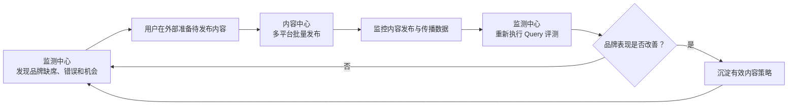
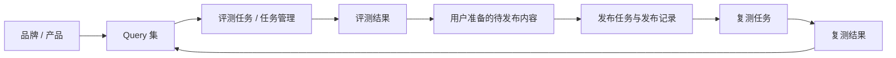

# GEO 双中心产品功能规划

> 产品结构：内容中心 + 监测中心  
> 核心闭环：发现问题 → 批量发布内容 → 监控平台数据 → GEO 复测验证

## 一、产品定位

GEO 产品帮助品牌完成两件事情：

1. **监测中心回答“现状和问题是什么”**：品牌在哪些 AI 问题中被提及、推荐或遗漏，竞品表现如何。
2. **内容中心回答“内容发布后表现如何”**：完成多平台授权、批量发布，并统一监控各平台内容表现。

两个中心形成完整业务闭环：

## 二、产品功能架构

```mermaid
flowchart TB
    GEO["GEO 产品"]

    GEO --> C["内容中心"]
    GEO --> M["监测中心"]

    C --> C1["平台授权"]
    C --> C2["批量发布"]
    C --> C3["各平台内容管理"]

    C1 --> C11["平台接入"]
    C1 --> C12["账号授权"]
    C1 --> C13["授权状态与续期"]

    C2 --> C21["内容录入与导入"]
    C2 --> C22["选择平台与账号"]
    C2 --> C23["多平台批量发布"]
    C2 --> C24["发布进度与失败重试"]

    C3 --> C31["统一内容列表"]
    C3 --> C32["按平台与账号筛选"]
    C3 --> C33["浏览、评论、点赞、收藏监控"]
    C3 --> C34["数据更新时间与异常状态"]

    M --> M1["Query 管理"]
    M --> M2["品牌 / 产品管理"]
    M --> M3["任务管理"]
    M --> M4["数据看板"]

    M1 --> M11["Query 新建与批量导入"]
    M1 --> M12["分类、标签与优先级"]
    M1 --> M13["Query 集与版本管理"]

    M2 --> M21["品牌标准信息"]
    M2 --> M22["品牌别名与产品归属"]
    M2 --> M23["竞品管理"]

    M3 --> M31["创建评测任务"]
    M3 --> M32["选择 Query 集与 AI 平台"]
    M3 --> M33["任务进度与失败重试"]
    M3 --> M34["原始回答与结构化分析"]

    M4 --> M41["品牌提及与推荐表现"]
    M4 --> M42["竞品与答案份额"]
    M4 --> M43["引用源与内容机会"]
    M4 --> M44["批次趋势与优化前后对比"]
```

## 三、内容中心功能规划

首版内容中心定位为多平台内容发布与数据监控工具，不负责 AI 改写和内容生产。

### 3.1 平台授权

统一管理内容平台和账号授权，为批量发布与数据同步提供基础能力。

| 功能 | 功能说明 | 优先级 |
| --- | --- | --- |
| 平台接入 | 展示当前支持发布和数据同步的平台 | P0 |
| 账号授权 | 按平台完成账号授权或 API 凭证配置 | P0 |
| 多账号管理 | 同一平台支持授权多个账号 | P0 |
| 授权状态 | 展示正常、即将过期、已失效和异常状态 | P0 |
| 重新授权 | 授权失效后引导用户重新连接 | P0 |
| 权限范围说明 | 明确账号支持发布及读取哪些数据 | P0 |

平台授权必须使用平台允许的官方接口或稳定合规方式，不保存用户明文密码。

### 3.2 批量发布

将用户已经准备好的内容一次发布到多个平台或账号。

| 功能 | 功能说明 | 优先级 |
| --- | --- | --- |
| 内容录入 | 输入标题、正文、封面及其他发布素材 | P0 |
| 批量导入 | 通过文件一次导入多篇待发布内容 | P1 |
| 选择平台与账号 | 为内容选择目标平台和账号 | P0 |
| 发布前预览 | 展示各平台最终发布内容和必填字段 | P0 |
| 多平台批量发布 | 创建并执行批量发布任务 | P0 |
| 发布进度 | 查看等待、发布中、成功和失败状态 | P0 |
| 失败原因与重试 | 展示平台错误并支持单独重试 | P0 |
| 定时发布 | 设置计划发布时间 | P1 |

首版不自动改写不同平台版本。若平台字段或格式不同，用户在发布前手动调整。

### 3.3 各平台内容管理

统一展示已发布内容及各平台返回的表现数据。

| 功能 | 功能说明 | 优先级 |
| --- | --- | --- |
| 统一内容列表 | 展示各平台已发布内容 | P0 |
| 平台与账号筛选 | 按平台、账号、状态和发布时间筛选 | P0 |
| 内容详情 | 查看发布内容、平台链接和发布时间 | P0 |
| 发布状态监控 | 展示成功、审核中、失败、下线等状态 | P0 |
| 浏览量监控 | 同步平台可提供的浏览量 | P0 |
| 评论量监控 | 同步平台可提供的评论数量 | P0 |
| 点赞量监控 | 同步平台可提供的点赞数量 | P0 |
| 收藏量监控 | 同步平台可提供的收藏数量 | P0 |
| 数据更新时间 | 展示最近同步时间及数据是否过期 | P0 |
| 数据趋势 | 查看内容互动数据随时间变化 | P1 |

各平台开放的数据范围和统计口径可能不同。产品必须明确标记“不支持”“未授权”和“暂未同步”，不能将缺失数据展示为零。

## 四、监测中心功能规划

监测中心首版固定为四个模块：Query 管理、品牌 / 产品管理、任务管理、数据看板。

### 4.1 Query 管理

Query 是监测中心的核心资产。

| 功能          | 功能说明                  | 优先级 |
| ----------- | --------------------- | --- |
| Query 新建与编辑 | 管理用户会向 AI 提出的真实问题     | P0  |
| 批量导入        | 通过表格一次导入多个 Query      | P0  |
| 分类与标签       | 按认知、比较、推荐、评价等场景分类     | P0  |
| 优先级         | 标记 Query 的业务价值和监测优先级  | P0  |
| Query 集     | 将 Query 组织为可重复运行的问题集  | P0  |
| 版本冻结        | 保证不同批次使用相同 Query 进行对比 | P0  |

### 4.2 品牌 / 产品管理

为评测结果识别提供统一的品牌和产品判断标准。

| 功能 | 功能说明 | 优先级 |
| --- | --- | --- |
| 品牌管理 | 管理品牌名称、官网、标准介绍和状态 | P0 |
| 品牌别名 | 配置中英文名、简称和常见写法 | P0 |
| 产品管理 | 管理产品名称、别名、品牌归属和状态 | P0 |
| 竞品管理 | 配置需要共同监测的竞品及其产品 | P0 |

### 4.3 任务管理

批量向多个 AI 平台执行 Query，并保存完整结果。

| 功能 | 功能说明 | 优先级 |
| --- | --- | --- |
| 创建评测任务 | 选择 Query 集、目标模型和采样次数 | P0 |
| 多模型评测 | 支持多个合规、稳定的 AI 平台 | P0 |
| 任务配置快照 | 保存 Query 版本、模型、参数和执行时间 | P0 |
| 任务进度 | 展示总数、成功、失败和剩余任务 | P0 |
| 失败重试 | 对失败 Query 单独重试 | P0 |
| 原始回答保存 | 完整保留 AI 返回内容和引用 | P0 |
| 品牌提及识别 | 判断品牌、产品和竞品是否被提及 | P0 |
| 推荐关系识别 | 判断回答是否明确推荐品牌或产品 | P0 |
| 引用来源提取 | 保存 AI 回答引用的网站与页面 | P0 |

### 4.4 数据看板

将评测结果转化为可以指导行动的数据。

| 功能 | 功能说明 | 优先级 |
| --- | --- | --- |
| 品牌提及率 | 展示品牌在有效回答中的出现比例 | P0 |
| 品牌推荐率 | 展示品牌被明确推荐的比例 | P0 |
| 竞品答案份额 | 对比目标品牌与竞品提及情况 | P0 |
| 原始回答下钻 | 所有指标均可查看对应回答证据 | P0 |
| Query 明细 | 查看每条 Query 在不同模型中的结果 | P0 |
| 引用来源分析 | 分析 AI 主要引用的网站与内容 | P0 |
| 批次对比 | 对比不同时间评测任务的变化 | P0 |

## 五、两个中心的职责边界

| 场景 | 监测中心负责 | 内容中心负责 |
| --- | --- | --- |
| 品牌在某类 Query 中未被提及 | 发现问题、提供原始回答和竞品证据 | 发布用户准备好的相关内容 |
| AI 对品牌描述错误 | 识别错误描述并关联品牌事实 | 发布用户准备好的纠正性内容 |
| 竞品持续被推荐 | 分析竞品提及、推荐和引用来源 | 将差异化内容批量发布至多个平台 |
| 内容完成发布 | 保存相关 Query 和历史评测基线 | 记录平台、账号、发布时间和链接 |
| 内容传播表现 | 后续结合 Query 评测结果验证 GEO 变化 | 监控浏览、评论、点赞和收藏数量 |

核心边界：

- **监测中心只负责发现、分析和验证，不直接修改外部内容。**
- **内容中心首版只负责平台授权、内容发布和平台数据监控，不负责内容生产与改写。**
- 两个中心通过 `Query、待发布内容、发布记录、评测批次` 建立关联。

## 六、核心对象关系

核心对象：

| 对象 | 作用 |
| --- | --- |
| 品牌 / 产品 | 定义需要识别、监测和表达的对象 |
| Query 集 | 定义希望影响的用户问题 |
| 评测任务 | 任务管理中的一次多模型批量评测 |
| 评测结果 | 保存原始回答和品牌表现分析 |
| 待发布内容 | 保存用户准备的标题、正文和素材 |
| 发布任务与记录 | 保存发布渠道、时间、状态和链接 |
| 复测结果 | 验证发布后的 GEO 表现变化 |

## 七、推荐版本规划

### P0：跑通最小闭环

目标：完成“监测发现问题 → 多平台批量发布 → 监控平台数据 → 重新评测”的完整闭环。

**监测中心**

- Query 管理与 Query 集版本。
- 品牌、产品、别名和竞品管理。
- 任务创建、执行、进度、失败重试和结果查看。
- 数据看板、原始回答下钻和批次对比。

**内容中心**

- 平台与账号授权。
- 用户录入待发布内容。
- 多平台批量发布、进度和失败重试。
- 各平台内容统一列表。
- 浏览、评论、点赞和收藏数量同步。

### P1：提升规模化运营效率

- 定时发布和批量内容导入。
- 周期评测。
- Query 智能扩展。
- 品牌事实库与风险表述。
- 平台内容数据趋势。
- 内容表现与 Query 评测结果关联。
- 风险、机会和异常告警。
- 报告导出。

### P2：形成策略优化平台

- AI 内容改写和渠道适配改写。
- 内容事实校验、合规检查和人工审核流程。
- 内容和信源策略模板库。
- 自动推荐优先优化的 Query。
- 多内容、多渠道效果对比。
- 行业基准与竞品长期趋势。
- 更完善的效果归因与策略沉淀。

## 八、P0 页面建议

一级导航只保留两个：

### 内容中心

- 平台授权
- 发布任务
- 平台内容

### 监测中心

- Query 管理
- 品牌 / 产品管理
- 任务管理
- 数据看板

评测结果不需要成为单独的一级菜单：

- 汇总结果在数据看板查看。
- 单次结果在任务详情查看。
- 单条 Query 结果在 Query 详情查看。

这能避免菜单按照数据对象重复拆分，让用户始终围绕“监测”和“发布监控”完成工作。

## 九、关键产品原则

1. **内容生产与改写暂不进入首版**，用户负责提供待发布内容。
2. **所有评测指标必须回溯原始回答**，避免只展示无法解释的分数。
3. **Query 集、评测配置和发布记录必须可追溯**，保证复测结果可比较。
4. **各平台数据口径必须明确**，缺失数据不能展示为零。
5. **优先支持稳定、合规的发布接口**，不依赖高风险的模拟登录与自动操作。
6. **不将相关变化表述为确定因果**，内容发布与评测变化之间需要持续积累证据。
